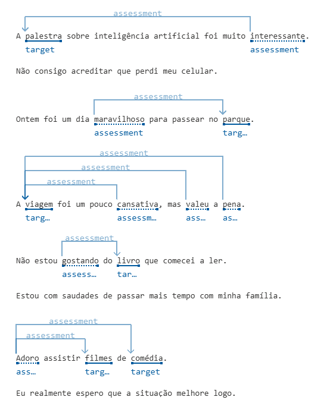
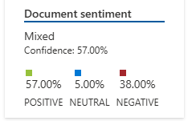

# Análise de Sentimentos - Azure AI

Este repositório contém o desafio realizado no Bootcamp DecolaTech 2025, onde utilizamos o **Azure AI** para realizar análise de sentimentos em algumas sentenças de exemplo.

## Sentimentos detectados
  - 57% Positiva
  - 5% Neutra
  - 38% Negativa

## Prints do processo:

